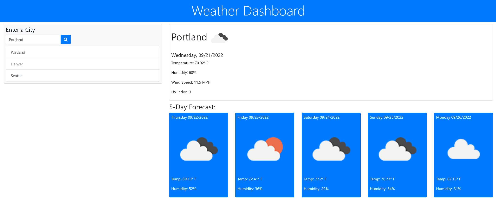

 

<h1 align="center">Weather Dashboard</h1>

  

    Weather Dashboard app built with Javascript, Jquery, Bootstrap, OpenWeather API, AJAX for API fetch
     
    Display 5 day forecast based on city via data from OpenWeather API.
     
    <a href="https://shiver750.github.io/Weather-Dashboard/">Click here to access app!</a>
  

<!-- ABOUT THE PROJECT -->
## About The Project
 

<!-- USAGE EXAMPLES -->
## Usage

Keep track of 5 day weather forecast of various cities through out the United States.

<!-- CONTACT -->
## Contact
<a href="https://www.linkedin.com/in/matt-szmytkowski-5418071a6/">Linkedin</a>
